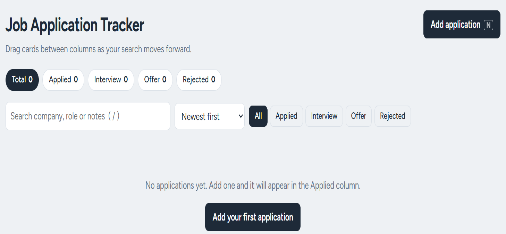

# Job Application Tracker


**Live demo:** https://job-tracker-us58.onrender.com

> The demo runs on a free instance, so the first load after a quiet period can take up to a minute, and demo data may reset when it restarts.



A REST API with a web UI for tracking job applications through the hiring pipeline: **applied → interview → offer / rejected**. I built it to manage my own job search.

## Features

- Pipeline board with one column per stage; drag cards between columns to update their status
- Add and edit applications (company, role, status, link, notes, date) in a dialog
- Search by company, role or notes, and sort by date or company
- Undo after deleting an application
- Light and dark mode that follows your system setting
- Full REST API with input validation and clear error messages
- Automated tests (pytest) and CI with GitHub Actions
- Docker support for easy deployment

## Tech Stack

Python 3.12, Flask, Flask-SQLAlchemy, SQLite, Gunicorn, vanilla JavaScript, pytest, Docker, GitHub Actions

## Getting Started

```bash
git clone https://github.com/SameerProDev/Job-Tracker.git
cd Job-Tracker
```

Create a virtual environment and activate it:

```bash
# Windows
python -m venv .venv
.venv\Scripts\activate

# Mac / Linux
python -m venv .venv
source .venv/bin/activate
```

Install dependencies and run:

```bash
pip install -r requirements.txt
python run.py
```

Open http://127.0.0.1:5000.

### With Docker

```bash
docker build -t job-tracker .
docker run -p 8000:8000 job-tracker
```

Open http://localhost:8000. Data is stored inside the container; mount a volume to keep it between runs.

### Run the tests

```bash
pytest -q
```

## API Reference

| Method | Endpoint                 | Description                             |
|--------|--------------------------|-----------------------------------------|
| GET    | `/api/applications`      | List all (optional `?status=interview`) |
| POST   | `/api/applications`      | Create (`company` and `role` required)  |
| GET    | `/api/applications/<id>` | Get one                                 |
| PUT    | `/api/applications/<id>` | Update any fields                       |
| DELETE | `/api/applications/<id>` | Delete                                  |
| GET    | `/api/stats`             | Totals grouped by status                |

Example (Mac / Linux / Git Bash):

```bash
curl -X POST http://127.0.0.1:5000/api/applications \
  -H "Content-Type: application/json" \
  -d '{"company": "Acme", "role": "Junior Developer"}'
```

Example (Windows PowerShell):

```powershell
Invoke-RestMethod -Uri http://127.0.0.1:5000/api/applications -Method Post `
  -ContentType "application/json" `
  -Body '{"company": "Acme", "role": "Junior Developer"}'
```

## Project Structure

```
app/            Flask app (factory, models, routes, static UI)
tests/          pytest test suite
docs/           Screenshots
.github/        CI workflow
Dockerfile      Container image
```

## Design Decisions

- **Application factory** pattern so tests can create an isolated in-memory database.
- **Validation in one place** (`validate()`), returning field-level errors.
- **SQLite** keeps setup zero-config; switching to PostgreSQL only needs a new `SQLALCHEMY_DATABASE_URI`.
- **Single-file vanilla JS UI** with no build step, served directly by Flask.

## Roadmap

- [x] Live deployment (Render)
- [ ] PostgreSQL and database migrations (Flask-Migrate), so demo data persists
- [ ] User accounts with JWT authentication
- [ ] Reminders for follow-ups
- [ ] Pagination and server-side search

## License

MIT